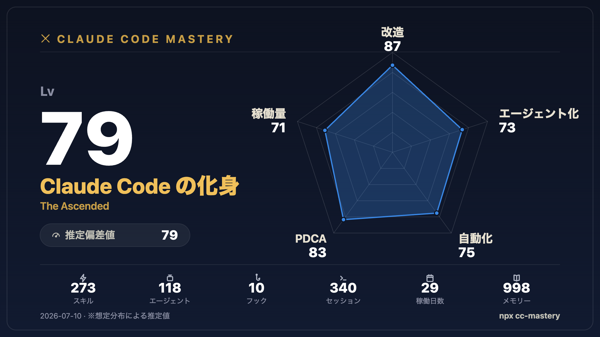

# cc-mastery

**あなたは Claude Code をどこまで使いこなしているか？**

ローカルの `~/.claude` をスキャンして、**RPG風ステータスカード**（5軸レーダー + 総合レベル + 称号 + 推定偏差値）を生成する CLI。依存パッケージゼロ、外部送信ゼロ。



## 使い方

```bash
npx cc-mastery
```

これだけ。ローカル解析 → 自己完結 HTML レポート生成 → ブラウザで開く。**「カードを PNG 保存」** ボタンで 2400×1350 の X 投稿用画像を書き出せます。

## 5軸

| 軸 | 測るもの |
|---|---|
| **改造** | スキル / スラッシュコマンド / CLAUDE.md / rules / permissions / プラグイン |
| **エージェント化** | agent 定義 / subagent 起動数 / subagent を使うセッション / MCP サーバー |
| **自動化** | hook スクリプト / イベントカバレッジ / hook 実行回数 / スキル発火数 |
| **PDCA** | memory ノート (feedback / reference) / plan ファイル / 設定バックアップ世代 |
| **稼働量** | アクティブ日数 / セッション数 / 出力トークン / プロジェクト数 |

全指標に飽和曲線 `100·x/(x+h)` を使用 — 初心者が 0 に張り付かず、パワーユーザーも 100 に到達しません。称号は支配的な軸で決まります: **司令塔アーキテクト** / **魔改造の匠** / **全自動の錬金術師** / **改善の求道者** / **不眠の開拓者**…… 全軸 70 超えなら **Claude Code の化身**。

## プライバシー

- ネットワークアクセス一切なし（解析・スコア・描画すべてローカル）
- 共有カードには**集計数値のみ**（スキル名 / プロジェクト名 / パス / モデル名は載らない）
- レポート下半分の詳細ダッシュボードは名前を含むローカル閲覧用（スクショ共有非推奨バナー付き）

## 偏差値は「推定」です

v0.1 の偏差値は想定分布に対する推定値です。v0.2 で opt-in の匿名スコア送信 → 実分布による本物の偏差値・上位N%・リーダーボードを予定しています。

## オプション

`--lang ja|en` / `--output` / `--json` / `--no-open` / `--project` / `--claude-dir` / `--no-cache`

2回目以降はファイル単位キャッシュ（size+mtime）で数秒で完了します。

## License

MIT
